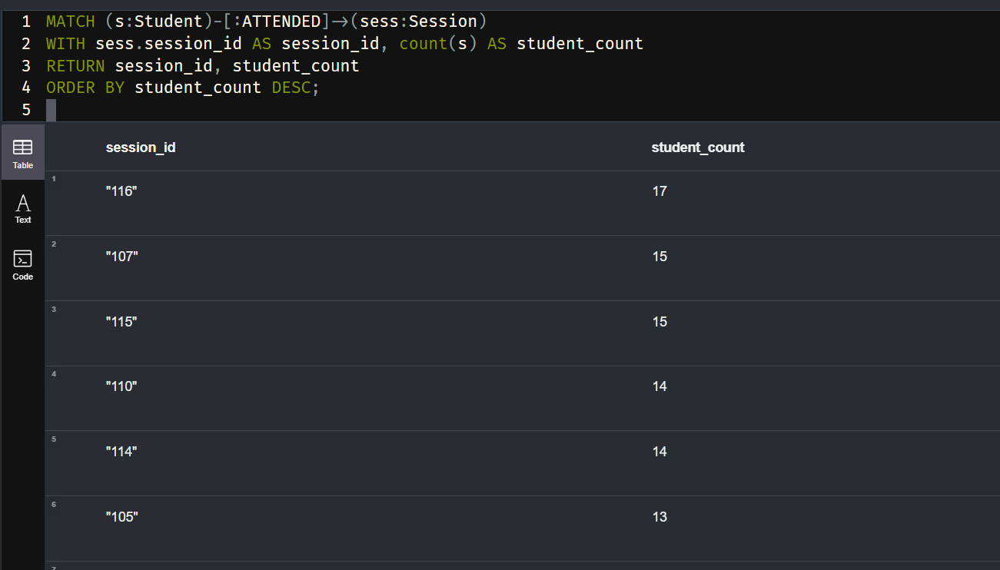

# DataOps-internship
## Overview 

The assignement aimes to: 
 Build a clean  OLAP Pipeline + Looker Dashboard and Graph Data Modeling with Neo4j
## Table of Contents

- [ETL PIEPLINE ](#introduction)

### looker studio 
You can access the link of the looker studio via this link https://lookerstudio.google.com/reporting/b9906a2e-117b-454d-abea-2dc422f2a6a4
The dashboard mainly answers 4 business questions:
1.	How does student enrollment change over time?
2.	What are the countries that have the mot number of students?
3.	What are the tracknames that have the most sales ?
4.	In Tunisia what are the hackerspaces that have the most numbe of students?
# Task 2: graph modeling with Neo4j
## prerequisities 

Docker Desktop 

To download neo4j using Docker, open the command line and type the following instruction:  
`docker pull neo4j`  
Create a container from the downloaded image. 
``docker run -it --name myneo –d -p7474:7474 -p7687:7687 neo4j``  

Go to the Neo4j container to start using it:  
``docker exec -it myneo bash``    

Now run the following command to launch Neo4j:
``cypher-shell``

the process of importing CSV data into Neo4j using Cypher.
``LOAD CSV WITH HEADERS FROM 'https://drive.google.com/uc?export=download&id=1m0nvGE9NwgHU2fb0FiUzZZuyEEwebX6n' AS row RETURN row ;``
The key nodes are Student and Session , attendance is the relationship between those nodes 
## Graph Schema Design
### 1. Create Student nodes from students.csv
``LOAD CSV WITH HEADERS FROM 'https://drive.google.com/uc?export=download&id=1m0nvGE9NwgHU2fb0FiUzZZuyEEwebX6n' AS row
MERGE (s:Student {student_id: row.student_id})
SET s.name = row.name,
    s.email = row.email;
``
### 2. Create Session  nodes from sessions.csv

``LOAD CSV WITH HEADERS FROM 'https://drive.google.com/uc?export=download&id= 10wiNhL7qEIulOMhCZ9HGt7INpG5OfR7-' AS row
MERGE (s:Session {session_id: row. session_id})
SET s.date = row. date,
s.instructor = row.instructor,
s.moduel= row. module``

### 3.Relationships 
``LOAD CSV WITH HEADERS FROM 'https://drive.google.com/uc?export=download&id=1KbDSPNGc7t6CgwZZlPbkr3A-JF7ZNzRR' AS row
MATCH (s:Student {student_id: row.student_id})
MATCH (sess:Session {session_id: row.session_id})
MERGE (s)-[:ATTENDED]->(sess);``
## Cypher Query Challenge
Q1. List all sessions attended by the student named “Alice”.
I replaced the name with David because we dont have a student named Alice 
``MATCH (s:Student {name: "David"})-[:ATTENDED]->(sess:Session)
RETURN sess.session_id, sess.date, sess.module, sess.instructor;``

● Q2. Find the top 3 students with the highest number of attended sessions.
``MATCH (s:Student)-[:ATTENDED]->(sess:Session)
WITH s, count(sess) AS attendance_count
ORDER BY attendance_count DESC
LIMIT 3
RETURN s.student_id, s.name, attendance_count;``

● Q3. Count how many students attended each session.
``
MATCH (s:Student)-[:ATTENDED]->(sess:Session)
WITH sess.session_id AS session_id, count(s) AS student_count
RETURN session_id, student_count
ORDER BY student_count DESC;
``

● Q4. For each module, get the number of unique students who attended at least one
session.

``MATCH (s:Student)-[:ATTENDED]->(sess:Session)
WITH sess.module AS module, collect(DISTINCT s.student_id) AS students
RETURN module, size(students) AS unique_student_count
ORDER BY unique_student_count DESC;
``

● Q5. Return a list of students who have never attended any session.
``MATCH (s:Student)
WHERE NOT (s)-[:ATTENDED]->(:Session)
RETURN s.student_id, s.name, s.email;``

We dont have any students that never attended a session 
# BONUS : Graph-to-SQL Conversion

 

